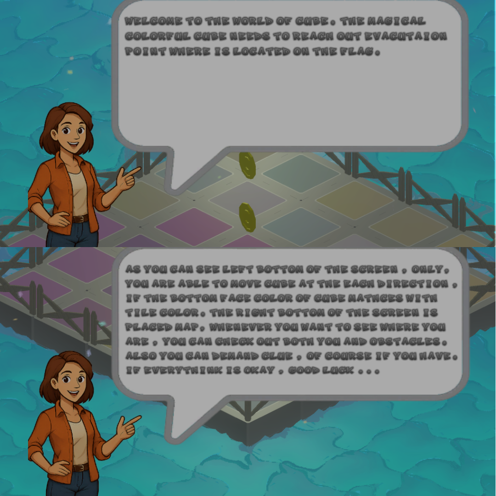

# Rumaroll

<h1>Purpose</h1>

The cube that is colorful is to reach out evacuation point by rolling on the tile that matches with it's bottom face colors. Each new stage means more extended platform.

<h1>How To Play</h1>

<h3>Android</h3>

As you can see , The buttons are placed on the screen of both left and right. You are able to manage by pressing move or another things about ui in here.To turn another point view , you are slightly slide your finger either from left to right or from right to left. This makes to be able to seen another point view towards to cube. 

<h2>MAIN MENU</h2>

 
 

 The players will start to game in here after lauched app. But if the tutorial passed , they must be started from continuous by passing in the store. Otherwise the recorded game is reseted.

 The main menu is the ui that is conducted the origin stream of game. The players might make various processes.

<h2>Continue & Store</h2>

 

 The players are able to purchase items or see count of items and loots that belongs just before start to game , if they would like

<h2>Multiplayer</h2>

 There are 2 different options. First one is the create game lobby that is setuped rooms by players. Second one is the lobby that joins players. Signaficant note : The wifi of device must had been turned on by the players before either create room or join room. The player who won is to be own the rewards end of the stage. The player who reach out to evacuation point wins the game , the first player(host) starts at the (6,6) referance point and the second player(client) starts at the (18,18) referance point. 

<h2>Settings</h2>

 The players might to prefer to turn off or initialize some settings about the game (e.g sound , vfx ..)

<h2>Tutorial - Stage 4 (4 x 4 Grid Platform)</h2>

 In this scene , player what have to do which is the will be told them by guide  when it start game. Players can collect the coins that is to be spent on the store to purchase items. It is easy stage

<h2>Day - From Stage 5 To Stage 12 (5 x 5 - 12 x 12) </h2>

 In this scene , player must be pay attendioned to obstacles and enemy that was placed either solution or unsolution ways. Anymore they can collect diamonds to purchase rare item on the store. Also they can use it on this scene. In addition these they can take a review map that is placed right bottom on the screen. The platform that is consist of colorful tiles is created with DFS data structures which is means each colorful tile where is placed in the platform has unique position of places when it restart. We might be take a look with point view just like mix of the open-word and platform games. At the each init of scene , the algorithm will run and generate another unique solution and platform. In addition these , at the last stage of day , you are going to encounter with enemy that has autonomous move features. In here , this system similarity with AI , it runs A* algorithm to find new path on the platform from start to arrive point to make arrive enemy. Also the obstacles that is placed at the previous stage are placed with particular data structures. The execute order is : First one is platform manager , Second one is event manager ,  Third one is Obstacle Manager , Latest is Enemy Manager. Thus the platform had been builded complately.

  

