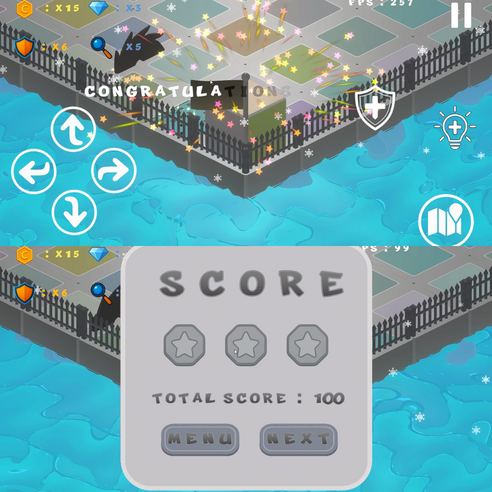

# RUMAROLL

<h1>!!!SIGNAFICANT & READ BEFORE!!!</h1>

The Name Of The Game Has Been Altered As "ROLORA". So the header that you seen where is on the following is old.

THIS GAME HAS BEEN BEING DEVELOPED BY ME(KAAN CINAR) WHO IS OWNER OF THE THIS GIT ACCOUNT. GAME WILL BE PUBLISHED COOMING SOON ON THE MOBILE PLATFORM.

Both singleplayer and multiplater all platforms are generated by using DFS Algorithm. 
That's why as the player was launched the game each stage, the platform will be generated with different solution paths. 
In addition this  all events and obstacles even enemies are spawned by using some data structures. 
For example enemies uses A* algorithm to explore path without collide with events(coins , diamonds, obstacles). 
Depends on the difficulty selection , the player might be encountered either more or less obstacles, enemies e.g.
Please Keep Going To Read And Then Enjoy The My Game

<h1>Purpose</h1>

The cube that is colorful is to reach out evacuation point by rolling on the tile that matches with it's bottom face colors. At the each new stage means more extended platform and more difficult obstacles

<h1>How To Play</h1>

<h3>Android</h3>

As you can see , The buttons are placed on the screen of both left and right. You are able to manage by pressing move or another things about ui in here.To turn another point view , you are slightly slide your finger either from left to right or from right to left. This makes to be able to seen another point view towards to cube. 

<h3>PC</h3>

To rolling the cube that you see in the bottom of the screen , you are to press from keyboard 'W','A','S','D'. To get clue , you must press keyboard 'C' as well as activated shield 'R'. If you press 'ESC' pause menu will be opened. If you want to see where you are , you can open map by pressing 'M'. To change aspect view , you can use either left or right arrow from keyboard.

<h2>MAIN MENU</h2>

 The players will start to game in here after lauched app. But if the tutorial passed , they must be started from continuous by passing in the store. Otherwise the recorded game is reseted.

 The main menu is the ui that is conducted the origin stream of game. The players might make various processes.

<h2>Settings</h2>

 The players might to prefer to turn off or initialize some settings about the game (e.g sound , vfx ..)

<h2>Continue & Store</h2>

 The players are able to purchase items or see count of items and loots that belongs just before start to game , if they would like

<h2>Profile Menu</h2>

 Player might be assign different materials their cube. The profile menu provides that. Players are able to select the materials , as they wish or the materials can be chosen as randomly.

<h2>Multiplayer</h2>

 There are 2 different options. First one is the create game lobby that is settled rooms by players as well as are able to select the platform options (Stage,Difficulty, E.g). If you selected the either normal or hard difficulty , you will encounter either the obstacles or enemy depends on your option. Second one is the lobby that joins players. In a 10 seconds you will be see a room , of course if it exists. Signaficant note : The wifi of device must had been turned on by the players before either create room or join room. The player who won is to be own the rewards end of the stage. The player who reach out to evacuation point wins the game , the first player(host) starts at the (6,6) referance point and the second player(client) starts at the (18,18) referance point. In here two player are connected to each other by using UDP socket protocol. Both two player must have been connected  same wi-fi network. Otherwise the game will be terminated and ended up on main-menu both two player.  

<h2>Tutorial - Stage 4 (4 x 4 Grid Platform)</h2>

 In this scene , player what have to do which is the will be told them by guide  when it start game. Players can collect the coins that is to be spent on the store to purchase items. It is easy stage

<h2>Day - From Stage 5 To Stage 12 (5 x 5 - 12 x 12) </h2>

 In this scene , player must be pay attendioned to obstacles and enemy that was placed either solution or unsolution ways. Anymore they can collect diamonds to purchase rare item on the store. Also they can use it on this scene. In addition these they can take a review map that is placed right bottom on the screen. The platform that is consist of colorful tiles is created with DFS data structures which is means each colorful tile where is placed in the platform has unique position of places when it restart. We might be take a look with point view just like mix of the open-word and platform games. At the each init of scene , the algorithm will run and generate another unique solution and platform. In addition these , at the last stage of day , you are going to encounter with enemy that has autonomous move features. In here , this system similarity with AI , it runs A* algorithm to find new path on the platform from start to arrive point to make arrive enemy. Also the obstacles that is placed at the previous stage are placed with particular data structures. The execute order is : First one is platform manager , Second one is event manager ,  Third one is Obstacle Manager , Latest is Enemy Manager. Thus the platform had been builded complately.

Ancient & Mystical (New Maps & Platforms)

<h3>New UI</h3>

As it progresses , you will explore new different maps ,platforms... e.g

<h3>Ancient Profile</h3>

<h3>Mystical Profile</h3>

<h2>Developer Diaries</h2>

<h3>New Enemy & Obstacles (Mystical & Ancient)</h3>

The FlameThrower spreads flames. If the player expose the flame over 0.5 seconds , it will be game over. Depends on the stage , the count of the flamethrower will be increase. Be Carefull !!!

The Dwarf is strolling free around the on the platform. If you are at the view aspect of the dwarf and move toward this aspect , it will notice and attack to you... . So do not try to move if dwarf looks toward you. Be Carefull !!!

<h3>DYNAMIC TILES</h3>

Dynamic tiles was placed for each 3 map. This tiles change properties(colors ,texture) depends on the shader properties. 
So it changes at the each 3 seconds between dummy and original. !!!
Dynamics changes color at the each 3 seconds. !!!
!!!Depends on the difficulty selection , whether dynamics tile can be existed at the platform...!!!
