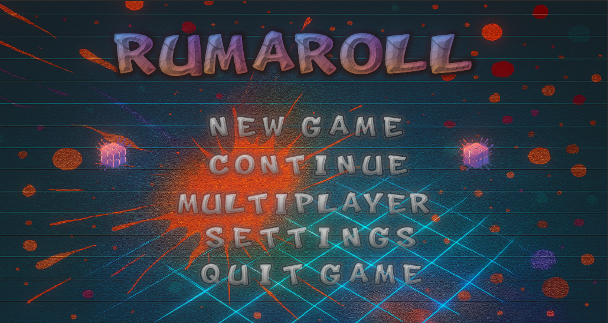

# ROLORA

<h1>!!!SIGNIFICANT & DO NOT PASS WITHOUT READ !!!</h1>

Solo-developed commercial game project targeting Android & iOS platforms.

The Name Of The Game Has Been Altered As "ROLORA". So the header that you seen where is on the following is old name and invalid.

THIS GAME HAS BEEN BEING DEVELOPED BY ME(KAAN CINAR) WHO IS OWNER OF THE THIS GIT ACCOUNT. GAME WILL BE PUBLISHED COOMING SOON ON THE MOBILE PLATFORM(ANDROID +10).

## Rolora Gameplay Teaser
https://youtu.be/G7CGt85ev9w

<ul>
    <li>Single Player: 3 maps × 4 stages (12 stages total)</li>
    <li>Local Multiplayer: UDP-based local multiplayer over Wi-Fi (LAN)</li>
    <li>Demo version with limited playtime (10 minutes, multiplayer disabled)</li>
    <li> Technologies: Unity, C#, SRP, URP, custom shaders (HLSL), Procedural level generation using data structures (DFS), UDP networking</li>
    <li>Planned commercial release (Android first, iOS next)</li>
</ul>

<h3>Structure Of The Game</h3>

Both singleplayer and multiplater all platforms are generated by using DFS Algorithm. 
That's why as the player was launched the game each stage, the platform will be generated with different solution paths. 
In addition this  all events and obstacles even enemies are spawned by using some data structures. 
For example enemies uses A* algorithm to explore path without collide with events(coins , diamonds, obstacles). 
Depends on the difficulty selection , the player might be encountered either more or less obstacles, enemies e.g.
Please Keep Going To Read And Then Enjoy The My Game

<h3>Structure Of The Game Graphics</h3>

The game is developed using Unity and utilizes the Scriptable Render Pipeline (SRP) based on the Universal Render Pipeline (URP). 
It employs a variety of mobile-optimized shaders, including unlit shaders and custom SRP-compatible shaders written in HLSL under URP fundamentals. 
The rendering backends supported are Vulkan 1.0+ (Android 10 and above) and OpenGL 3.2+.

<h1>Purpose</h1>

The cube that is colorful is to reach out evacuation point by rolling on the tile that matches with it's bottom face colors. At the each new stage means more extended platform and more difficult obstacles

<h1>How To Play</h1>

<h3>Android</h3>

As you can see , The buttons are placed on the screen of both left and right. You are able to manage by pressing move or another things about ui in here.To turn another point view , you are slightly slide your finger either from left to right or from right to left. This makes to be able to seen another point view towards to cube. 

<h3>PC</h3>

To rolling the cube that you see in the bottom of the screen , you are to press from keyboard 'W','A','S','D'. To get clue , you must press keyboard 'C' as well as activated shield 'R'. If you press 'ESC' pause menu will be opened. If you want to see where you are , you can open map by pressing 'M'. To change aspect view , you can use either left or right arrow from keyboard.

<h2>MAIN MENU</h2>

 The players will start to game in here after lauched app. But if the tutorial passed , they must be started from continuous by passing in the store. Otherwise the recorded game is reseted.

 The main menu is the ui that is conducted the origin stream of game. The players might make various processes.

<h2>Settings</h2>

 The players might to prefer to turn off or initialize some settings about the game (e.g sound , vfx ..). 
The significant note that is the post-processing options is recommended high - performance devices which is higher Android api (+12 , Mali G71, Adreno 540, Adreno 610 or higher) 

<h2>Map Selection</h2>

If you already had started the game by clicking the 'SinglePLayer' , then you would must continue by choosing the map that you have been playing.
After you selected the map , the game will load the profile screen.

<h2>Profile Menu</h2>

 Player might be assign different materials their cube. The profile menu provides that. Players are able to select the materials , as they wish or the materials can be chosen as randomly.

<h2>Store</h2>

 The players are able to purchase items or see count of items and loots that belongs just before start to game , if they would like

<h2>Multiplayer</h2>

 There are 2 different options. First one is the create game lobby that is settled rooms by players as well as are able to select the platform options (Stage,Difficulty, E.g). If you selected the either normal or hard difficulty , you will encounter either the obstacles or enemy depends on your option. Second one is the lobby that joins players. In a 10 seconds you will be see a room , of course if it exists. Signaficant note : The wifi of device must had been turned on by the players before either create room or join room. The player who won is to be own the rewards end of the stage. The player who reach out to evacuation point wins the game , the first player(host) starts at the (6,6) referance point and the second player(client) starts at the (18,18) referance point. In here two player are connected to each other by using UDP socket protocol. Both two player must have been connected  same wi-fi network. Otherwise the game will be terminated and ended up on main-menu both two player.  

<h2>Colorful</h2>

In the begin of the each stage , player what have to do which is the will be told them by guide  when it start game(If you want to keep going without read
, you can click forward button where is placed top of the left of the screen). The map which is named as 'COLORFUL' contains 4 stage. 
There are 3 different weather status(Sunny(Flyies Dusty Particules), Rainy and Snowy. The Guide can be skipped , if the player wants to passing it

<h3>Ancient</h3>

The 'Ancient' Map that would be opened after the completed the 'Colorful' map. There is a lava sea where is surrounded of the platform. 
This map is more complicated and longer than 'Colorful' map. You have to get activated by rotray bridges and take key... 
Of course watch out the obstacles. Beside this you can explore the emerald loot higher possibility than 'Colorful'

<h3>Mystical</h3>

The last map of the game is 'Mystical'. It is less complicated than the 'Ancient' map but more exhausted than it. 
The magicful atmosphere of it might be surprised you. Watch out the dwarf the last stage !!! 

<h3>ABOUT THE DYNAMIC TILES</h3>

Dynamic tiles exists for each 3 map. This tiles change properties(colors ,texture) depends on the shader properties. 
So it changes at the each 3 seconds between dummy and original. !!!
Dynamics changes color at the each 3 seconds. !!!
!!!Depends on the difficulty selection , whether dynamics tile can be existed at the platform...!!!

<h3>HAVE FUN!!!</h3>

